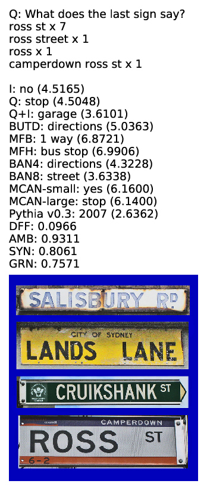
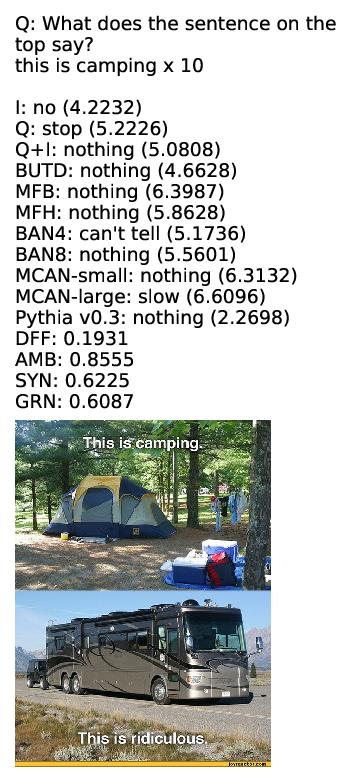
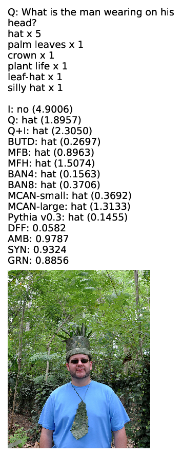
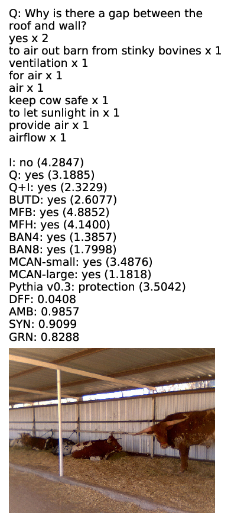

# Visual Question Difficulty (VQD)

The code of "Which visual questions are difficult to answer? Analysis with Entropy of Answer Distributions"
This paper analysis the VQA v2.0 dataset and
proposes a clustering approach for finding difficult visual questions to answer.
There are 10 clusters, and the difficulty increases from cluster 0 (easyest) to clsuter 9 (hardest).


## How to generate images of visual questions for each cluster

```
wget https://s3.amazonaws.com/cvmlp/vqa/mscoco/vqa/v2_Annotations_Val_mscoco.zip
wget https://s3.amazonaws.com/cvmlp/vqa/mscoco/vqa/v2_Questions_Val_mscoco.zip
wget http://images.cocodataset.org/zips/val2014.zip

unzip v2_Annotations_Val_mscoco.zip
unzip v2_Questions_Val_mscoco.zip
unzip val2014.zip

gunzip test_qid_label.csv.gz val_qid_label.csv.gz val_all.csv.gz 

python ./qid_to_visual_questions.py
```

Then PDF files of visual questions are generated in `val_clusters` folder.
(Some example files are already stored)

# Files

- `val_qid_label.csv` contains lines, each of which is a pairs of question ID (of the VQA v.2 validation set) and cluster number in the following format. You can find which questions are in which cluster.
```
qid,label
42000,2
42001,1
42002,8
...
```
- `test_qid_label.csv` contains lines, each of which is a pairs of question ID (of the VQA v.2 **test** set) and cluster number in the following format. You can find which questions are in which cluster.
```
qid,label
1000,3
1001,2
1002,8
...
```
- `val_all.csv` contains liens, each of which shows VQA results for question ID (of the VQA v.2 validation set).
```
qid,q_entropy,q_answer,q_score,i_entropy,i_answer,i_score,iq_entropy,iq_answer,iq_score,image,question,answer_variety,answer_entropy,gt_answers,answer_type,gt_max_count,clustering_label,i_score_normal,q_score_normal,iq_score_normal,LQI,IVE,INV,DFF,AMB,SBJ,SYN,GRN,SPM,OTH,butd_entropy,butd_answer,butd_score,butd_score_normal,mfb_entropy,mfb_answer,mfb_score,mfb_score_normal,mfh_entropy,mfh_answer,mfh_score,mfh_score_normal,ban_4_entropy,ban_4_answer,ban_4_score,ban_4_score_normal,ban_8_entropy,ban_8_answer,ban_8_score,ban_8_score_normal,mcan_small_entropy,mcan_small_answer,mcan_small_score,mcan_small_score_normal,mcan_large_entropy,mcan_large_answer,mcan_large_score,mcan_large_score_normal,dfaf_entropy,dfaf_answer,dfaf_score,dfaf_score_normal,pythia_v3_entropy,pythia_v3_answer,pythia_v3_score,pythia_v3_score_normal,label
42000,2.3424739837646484,black,0.0,4.930522918701172,no,0.0,0.1799551099538803,white,100.0,COCO_val2014_000000000042.jpg,What color are the gym shoes?,2,0.3250829733914482,"['white', 'white', 'white', 'white', 'white and black', 'white', 'white', 'white', 'white', 'white']",other,9,4,0.0,0.0,100.0,0.020895544439554214,0.037593573331832886,0.009513395838439465,0.026912560686469078,0.9473015069961548,0.1447487771511078,0.7772025465965271,0.8031096458435059,0.0075778653845191,0.0013863417552784085,2.643578052520752,gray,0.0,0.0,1.5392333269119263,black,0.0,0.0,1.5613505840301514,red,0.0,0.0,2.081714153289795,white,100.0,100.0,2.4865617752075195,black,0.0,0.0,2.3235793113708496,red,0.0,0.0,0.3449086546897888,red,0.0,0.0,1.7205684185028076,down,100.0,100.0,0.006065487993720852,white,100.0,100.0,2
...
```


# Visual question samples

Here are some examples from cluster 9 and 8.

# Cluster 9




# Cluster 8




